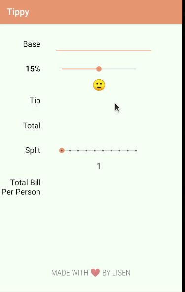

# Tip Calculator 

## Lisen Deng

**Tippy** computes the tip and total amount for a bill. The app uses the base amount and tip percentage to calculate the amount owed, and it also describes the quality of service based on the tip.

Time spent: **5** hours spent in total

## Functionality 

The following **required** functionality is completed:

* [x] User can enter in a bill amount (total amount to tip on)
* [x] User can enter a tip percentage (what % the user wants to tip).
* [x] The tip and total amount are updated immediately when any of the inputs changes.
* [x] The user sees a label or color update based on the tip amount. 

The following **extensions** are implemented:

* [x] Custom colors palette selected
* [x] Change the tip label to emojis
* [x] Split bills among 1-10 person

## Video Walkthrough

Here's a walkthrough of implemented user stories:

GIF created with [Peek](https://github.com/phw/peek).

## Notes

The seekbar widget can't set a minimum value using API21. When calculating the number of people to split the bill, adding one to the progress of seekbar is necessary since the default minimum value is zero.

## License

    Copyright [2020] [Lisen Deng]

    Licensed under the Apache License, Version 2.0 (the "License");
    you may not use this file except in compliance with the License.
    You may obtain a copy of the License at

        http://www.apache.org/licenses/LICENSE-2.0

    Unless required by applicable law or agreed to in writing, software
    distributed under the License is distributed on an "AS IS" BASIS,
    WITHOUT WARRANTIES OR CONDITIONS OF ANY KIND, either express or implied.
    See the License for the specific language governing permissions and
    limitations under the License.
